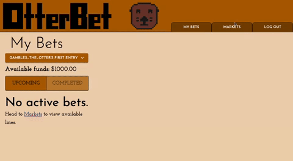

# OtterBet
OtterBet is a sportsbetting simulation app for users to place wagers on real Vegas lines set by real sportsbooks on real NFL games, but without spending real money.

## Setup
The easiest way to use OtterBet is to visit www.otterbet.win.

If you would like to run OtterBet locally, you can instead follow the steps below.

1. Fork and clone this repo.
2. Open the repo in VS Code (or you editor of choice -- these instructions are written with VS Code in mind)
3. Create a Postgres database called "otterbet". Copy the queries from "otterbet.sql" and run each query in your new database.
    - This data is a snapshot from Monday, September 18th. There is code included for querying new data, but you will need to get API keys for odds-api and API-Sports and include them in a .env file.
4. Open the terminal and run the command "npm install"
5. Split the terminal and run the commands "npm run server" and "npm run client" in each terminal division.

The app should now be running on localhost:3000.

## Features
Users may place wagers on upcoming NFL games (using mock funds), and review the status of completed wagers. User funds will be updated according to the results of the completed wagers.

## Technologies
OtterBet was built with the following technologies:
 - Node.js
 - React
 - React-Router-DOM
 - React Redux
 - Axios
 - Express
 - PostgreSQL
 - Material UI

Data was collected from the following API sources:
 - [odds-api](https://the-odds-api.com/)
 - [API-Sports](https://api-sports.io/)

## Objectives
The primary goal of this project was to create a functional full-stack React app with a dynamic user experience utilizing data from third-party API. 

## Duration
This project was primarily developed over a two-week sprint in September 2023. Minor refactoring has continued since then, but major refactoring and feature additions will be reserved for committed future sprints.

## Future Goals
Next updates to OtterBet will center on more general concerns:
 - Refactor code to limit technical debt
 - Develop personalized user profiles
 - Improve styling

However, there are also several major features which could be developed after completion of "housekeeping" tasks.
 - Refresh game data through automated API requests at set intervals
 - Implementation of additional leagues beyond the NFL
 - Implementation of public contests for users to compete with one another
 - Make additional game data available to users, such as team and player statistics
 - Add sorting and filtering options on user and market bets for improved user experience

A more detailed list of refactoring and feature aspirations can be found on this [Trello board](https://trello.com/b/H5o8f8Su/otterbet).

## Acknowledgments
OtterBet would not have been possbile without the support of the staff at Prime Digital Academy, as well as my peers in the Iolite cohort.